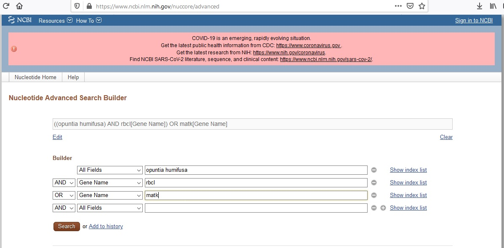

R Assignment 4: Creating Phylogenetic Trees using Genbank data
================

   

#### Motivation

Add section…

-----

   

#### Prerequisites

Before starting this week’s tutorial you will have:  

1.  completed some pre-assignment reading on DNA barcoding, multiple
    sequence alignment, phylogenetics, and their role in plant taxonomy,
     

2.  completed some pre-assignment reading on why/how Genbank is used by
    plant taxonomists,  

3.  navigated through the Genbank website and understand what it is and
    why it exists.

4.  **MB** Get students to read (for example, something like) Majure et
    al (2012), Am. J. Bot. if we end up using *Opuntia* as an example…

-----

   

#### Outcomes

By the end of this tutorial you will have:  

1.  experience using Genbank, CLUSTAL, and the most common phylogenetics
    packages in R  

2.  familiarity with Genbank and the types of data that can be obtained,
     

3.  the tools and knowledge needed to create your own phylogenetic tree
    as part of a taxonomic research programme,  

4.  …more

-----

   

#### Activity 1: Downloading, Aligning, and Graphing DNA Sequences from Genbank

In previous Assignments we familiarized ourselves with GBIF, R, RStudio
Cloud, and the R packages that allow us to connect to databases. Today,
we’ll learn how to use our newfound R skills to download and align
nucleotide sequences from
[GenBank](https://www.ncbi.nlm.nih.gov/nuccore), a repository of DNA
sequences hosted by the National Center for Biotechnology Information
(NCBI). We’ll then use the aligned sequences to create a phylogenetic
tree that will organize species based on their relatedness.

In this lab, we’ll explore further the genus *Opuntia*:  

*Opuntia basilaris* (Mojave, Colorado, Utah)   *Opuntia fragilis*
(Northwestern)   *Opuntia humifusa* (Eastern)   *Opuntia oricola*
(Coastal sage and chaparral of S. California)   *Opuntia polyacantha*
(Great Plains, foothills of Rocky Mtns)  

**MB** Could add in some natural history background to better motivate
this activity.  

Open this week’s .R file (‘324\_Phylogenetics.R’) and navigate to the
source pane. Install and attach the necessary packages using
`install.packages()` and `library()`. By highlighting and running lines
38-111, we can run the script that searches Genbank for *matK* and
*rbcL* sequences from our five *Opuntia* species.

Selecting and running lines 120-167 will generate three phylogenetic
trees. The first tree illustrates the relationships between species
based only on the nucleotide sequences of the *matK* gene. The second
tree does the same thing, but for the *rbcL* gene. The third tree
considers both sequences. Since this tree has the most information, it
is often considered a better estimate of the true relationships between
species.

 

**MB** Could add in some discussion here about why different genes
produce different trees.

-----

   

#### Activity 2: Dechyphering some code

Let’s step through the script in order to understand what is happening
here.

 

**Lines 14-18**: The `library()` function loads various packages
designed specifically for connecting with the Genbank database (`ape`),
filtering and organizing our data (`tidyverse`), aligning sequences
(`msa`), concatenating sequences (`seqinr`), and constructing
phylogenetic trees (`ape`).

**Lines 38-40**: The `c()` concatenates the elements specified inside
the brackets `()` into an object. For example, the `species` object
contains five elements - each one is the name of an *Opuntia* species
that we are interested in. The `matK_acc` object contains the Genbank
accession numbers for each species. These were found by searching
Genbank like so:

 

**Line 42**: From our three objects created above, we will merge them
together into a dataframe. The purpose of this dataframe is to keep our
accession numbers and species names organized - it will come in handy
later\!

function searches GBIF for taxon IDs associated with your search query.
The `<-` function stores the results in an object that we named
`group1_ids`. By storing the results in an object we can later return to
the object and inspect it, subset it, and feed it to other functions.

**Lines 50-56**: The `read.Genbank()` function searches Genbank for
nucleotide sequences associated with our search query. In this case, we
are giving `read.Genbank()` our accession numbers for the *matK* that we
collected earlier.

**Line 59**: Because Genbank returns the nucleotide sequences with
accession numbers, we want to re-name them with English names for easier
reading later on.

**Lines 70-79**: Here, we’re collecting sequence information from
Genbank, but for the *rbcL* gene.

**Lines 93-98**: Now that we have some DNA sequences, we need to align
them. The `msa()` function takes our sequences and uses the CLUSTAL
algorithm to make an optimal alignment (you could also do this by eye,
but this becomes difficult with many sequences).

**Line 100**: The `print()` function allows us to inspect the alignment.

**Lines 103-111**: Here, we’ll go through the same alignment procedure
for the *rbcL* sequences.

**Line 124**: In addition to constructing phylogenies for each gene
separately, we’ll also construct a phylogeny using both sequences
concatenated together. The `paste0()` function allows us to string the
*matK* and *rbcL* sequences together.

**Lines 128-135**: With our concatenated sequences, we’ll re-align with
CLUSTAL once more using the `msa()` function.

**Lines 148-150**: To construct a phylogeny, we first need to know how
similar or dissimlar each species’ DNA sequence is from another. The
`dist.alignment()` function calculates a ‘distance matrix’ that
describes these similarities.

**Lines 154-156**: With our distance matrices, we can now construct a
phylogenetic tree. The `nj()` function creates a certain type of tree
called a ’neighbour joining tree\`

**MB**: Perhaps need to explain this terminology (distance matrix,
neighbour joining) in pre-assingment reading, or lectures.

**Line 159-161**: Now it’s time to plot our trees\! The *matK* and
*rbcL* trees were shown earlier, below is the consensus tree:

   
